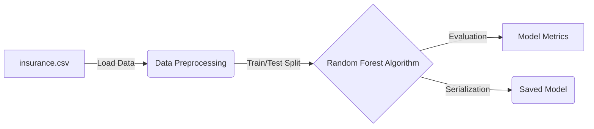

# 📈 ML Insurance Predictor (ml_c)

A machine learning pipeline designed to predict insurance costs based on demographic and health data.

## 🏗 Architecture
This project focuses on the data science and machine learning lifecycle, from raw data to a deployable model.
- **Data Source**: Medical cost personal datasets (`insurance.csv`).
- **Core Script**: `main.py` handles data cleaning, feature engineering, and model training.
- **Dependency Tracking**: Uses `pyproject.toml` and `uv.lock` for exact dependency resolution.



## 🚀 Setup & Training
1. **Install Dependencies**:
   ```bash
   pip install -r requirments.txt
   ```
2. **Train the Model**:
   Run the main script to process the data and output the predictions.
   ```bash
   python main.py
   ```
